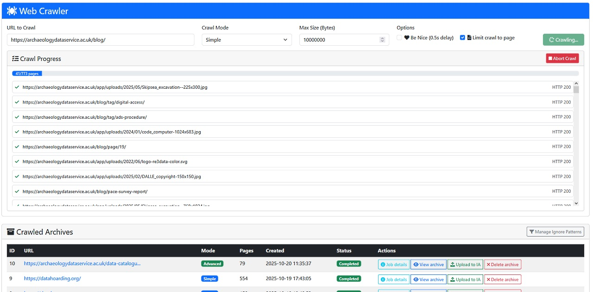
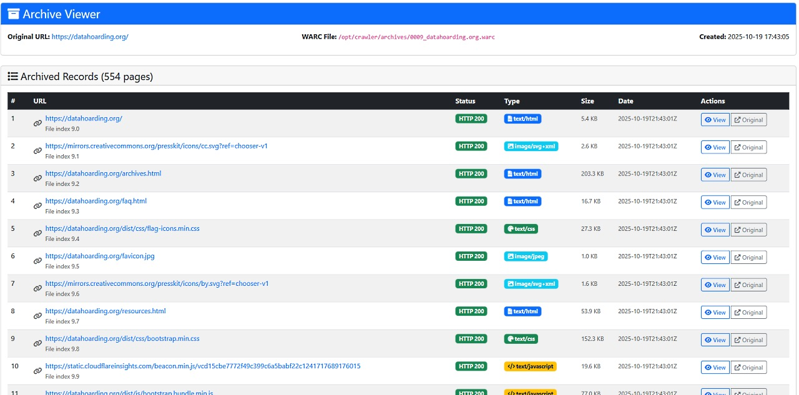

# Web Crawler Application

This is a modern self-hosted web crawler application that creates WARC archives from web sites with a WARC viewer.





## Features

- **Simple, Wiki and Advanced crawling modes**: Basic HTTP requests or Chromium-based crawling
- **WARC archive creation**: Creates standard WARC files for web archiving
- **Bootstrap web interface**: Modern web UI for managing crawls and viewing archives
- **Internet Archive integration**: Upload archives directly to Internet Archive
- **Pattern-based URL filtering**: Ignore unwanted URLs during crawling
- **Retry logic**: Retry mechanism for handling temporary failures
- **Automatic detection of additional archives**: Every 5 minutes, newly added or deleted archives are detected

## Installation

### Docker Installation

```bash
   docker run -d \
     --name webcrawler \
     --restart always \
     -p 8080:8080 \
     -v /path/to/your/data/archives:/data/archives \
     -v /path/to/your/data/db:/data/db \
     -v /path/to/your/data/temp:/data/temp \
     -v /path/to/your/data/config:/data/config \
     dendory02/webcrawler:latest
```

The web interface will be available at: `http://localhost:8080`

### Manual Installation

#### Prerequisites

- Linux host (Ubuntu/Debian, CentOS/RHEL, or Fedora)
- Python 3.7 or higher
- pip3

#### Installation

1. **Download the zipped repo to your Linux host**
2. **Run the installation script as root:**

```bash
sudo ./install.sh
```

The installation script will:
- Create the directory structure at `/opt/crawler/`
- Install Python dependencies in a virtual environment
- Set up the systemd service
- Configure crontab for the runner script
- Start the web crawler service

## Directory Structure

After installation, the application uses the following directory structure:

```
/opt/crawler/
├── app/                    # Application files
│   ├── crawler.py          # Main web crawler application
│   ├── runner.py           # Manual archive runner script
│   └── templates/          # Web interface templates
├── config/                 # Configuration files
│   ├── crawler.cfg         # Main configuration
│   └── default_ignores.tsv # Default URL ignore patterns
├── archives/               # WARC archive files
├── db/                     # SQLite database
├── temp/                   # Temporary crawl files
└── venv/                   # Python virtual environment
```

## Configuration

The main configuration file is located at `/opt/crawler/config/crawler.cfg`.

Key settings include:

- **Web Interface**: IP address and port (default: 0.0.0.0:8080)
- **SSL Settings**: Certificate and key paths for HTTPS
- **Connection Settings**: Timeout, retry limits, and delays
- **File Size Limits**: Maximum sizes for displaying binary files
- **Crawling Settings**: User agents, accept headers, and language preferences

### Password Authentication

The web crawler includes a simple password-based authentication system to protect access to the web interface. The default password is **`archive`**.

To change the password, you need to generate a SHA256 hash of your new password and update the configuration file. For example:

```bash
 echo -n "your_new_password" | sha256sum
```

## Usage

Access the web interface at `http://your-server:8080` (or your configured IP/port).

Features:
- Start new crawls with custom settings
- View crawl progress in real-time
- Browse and download WARC archives
- Upload archives to Internet Archive
- Manage URL ignore patterns

## License

Copyright © 2025 Patrick Lambert [patrick@dendory.ca]

Permission is hereby granted, free of charge, to any person obtaining a copy of this software and associated documentation files (the “Software”), to deal in the Software without restriction, including without limitation the rights to use, copy, modify, merge, publish, distribute, sublicense, and/or sell copies of the Software, and to permit persons to whom the Software is furnished to do so, subject to the following conditions:

The above copyright notice and this permission notice shall be included in all copies or substantial portions of the Software.

THE SOFTWARE IS PROVIDED “AS IS”, WITHOUT WARRANTY OF ANY KIND, EXPRESS OR IMPLIED, INCLUDING BUT NOT LIMITED TO THE WARRANTIES OF MERCHANTABILITY, FITNESS FOR A PARTICULAR PURPOSE AND NONINFRINGEMENT. IN NO EVENT SHALL THE AUTHORS OR COPYRIGHT HOLDERS BE LIABLE FOR ANY CLAIM, DAMAGES OR OTHER LIABILITY, WHETHER IN AN ACTION OF CONTRACT, TORT OR OTHERWISE, ARISING FROM, OUT OF OR IN CONNECTION WITH THE SOFTWARE OR THE USE OR OTHER DEALINGS IN THE SOFTWARE.
